# Sets


[](https://goreportcard.com/report/github.com/freeformz/sets)
[](http://godoc.org/github.com/freeformz/sets)

A generics based go set package that supports modern go features like iterators.

If you like this repo, please consider checking out my [iterator tools repo](https://github.com/freeformz/seq).

## Install

Use go get to install this package.

```console
go get github.com/freeformz/sets
```

## Features

* [Generics](https://go.dev/doc/tutorial/generics) based implementation.
* Common, minimal interface based Set type.
* Iterator support in the Set type and set methods.
* Multiple set implementations:
  * `New()` -> Map based set;
  * `NewLocked()` -> Map based that uses a lock to be concurrency safe;
  * `NewSyncMap()` -> sync.Map based (concurrency safe);
  * `NewOrdered()` -> ordered set (uses a map for indexes and a slice for order);
  * `NewLockedOrdered()` -> ordered set that is concurrency safe;
  * `NewSortedSet()` -> always sorted set backed by a single sorted slice. O(log n) `Contains`, O(1) `At`, range queries via `Range(lo, hi)`, and lower memory use, at the cost of O(n) `Add`/`Remove`. Best for read-heavy workloads. Wrap with `NewLockedOrderedWrapping(NewSortedSet[int]())` to make it concurrency safe.
  * `NewBitSet()` -> always sorted set for integer element types, backed by a dense bitmap. O(1) `Add`/`Remove`/`Contains`, and `Union`/`Intersection`/`Difference`/`SymmetricDifference` between two `BitSet`s run word-wise (64 elements per CPU op). **Memory is proportional to the span (max − min) of the elements, not the count** — S/8 bytes for a span of S values. That's tiny for dense, bounded domains (IDs, ports, enum values: a full uint16 universe is 8 KiB) but pathological for sparse far-apart values (`Add(0)` then `Add(1<<40)` needs ~128 GiB and panics). `Reserve(lo, hi)` preallocates, `Compact()` releases memory after removals, `Clear()` drops the backing array. Wrap with `NewLockedOrderedWrapping(NewBitSet[int]())` to make it concurrency safe.
* `sets` package functions align with standard lib packages like `slices` and `maps`.
* Implement as much as possible as package functions, not Set methods.
* Exhaustive unit tests via [rapid](https://github.com/flyingmutant/rapid).
* Somewhat exhaustive examples.

## Usage

[Package Level Examples](https://pkg.go.dev/github.com/freeformz/sets#pkg-examples)

[Set Example](https://pkg.go.dev/github.com/freeformz/sets#example-Set)

[OrderedSet Example](https://pkg.go.dev/github.com/freeformz/sets#example-OrderedSet)

## JSON

Sets marshal to/from JSON as JSON arrays.
A JSON array with repeated values unmarshaled to a Set will not preserve duplicates.
An empty Set marshals to `[]`.
OrderedSets preserve order when {un,}marshaling, while Sets do not.

Sets of types that don't have a JSON equivalent can't be marshaled to and/or from JSON w/o an error. For instance a Set of an interface type can marshal to json, but can't then un-marshal back to Go w/o an error.

## SQL

All set types implement `sql.Scanner` and `driver.Valuer`, allowing them to be used directly with `database/sql`. Values are stored as JSON arrays.

## Set Helpers

These helpers work on all Set types, including OrderedSets.

* `sets.Elements(aSet)` : Elements of the set as a slice.
* `sets.AppendSeq(aSet,sequence)` : Append the items in the sequence (an iterator) to the set.
* `sets.RemoveSeq(aSet,sequence)` : Remove the items in the sequence (an iterator) from the set.
* `sets.Union(aSet,bSet)` : Returns a new set (of the same underlying type as aSet) with all elements from both sets.
* `sets.Intersection(aSet,bSet)` : Returns a new set (of the same underlying type as aSet) with elements that are in both sets.
* `sets.Difference(aSet,bSet)` : Returns a new set (of the same underlying type as aSet) with elements that are in the first set but not in the second set.
* `sets.SymmetricDifference(aSet,bSet)` : Returns a new set (of the same underlying type as aSet) with elements that are not in both sets.
* `sets.Subset(aSet,bSet)` : Returns true if all elements in the first set are also in the second set.
* `sets.Superset(aSet, bSet)` : Returns true if all elements in the second set are also in the first set.
* `sets.Equal(aSet, bSet)` : Returns true if the two sets contain the same elements.
* `sets.Disjoint(aSet, bSet)` : Returns true if the two sets have no elements in common.
* `sets.ContainsSeq(aSet, sequence)` : Returns true if the set contains all elements in the sequence. Empty sets are considered to contain only empty sequences.
* `sets.Iter2(sequence)` : Returns a (int,V) iterator where the int represents a "pseudo" index.
* `sets.Max(aSet)` : Returns the max element in the set as determined by the max builtin.
* `sets.Min(aSet)` : Returns the min element in the set as determined by the min builtin.
* `sets.Chunk(aSet,n)` : Chunks the set into sets of n elements each. The last set will have fewer elements if the cardinality of the set is not a multiple of n.
* `sets.IsEmpty(aSet)` : Returns true if the set is empty, otherwise false.
* `sets.MapBy(aSet, func(v V) X { return ... }) bSet` : Maps the elements of the set to a new set.
* `sets.MapTo(aSet, bSet, func(v V) X { return ... })` : Maps the elements of aSet into bSet.
* `sets.MapToSlice(aSet, func(v V) X { return ... }) aSlice` : Maps the elements of the set to a new slice.
* `sets.Filter(aSet, func(v V) bool { return true/false }) bSet` : Filters the elements of the set and returns a new set.
* `sets.Reduce(aSet, X, func(X, K) X { return ... }) X` : Reduces the set to a single value.
* `sets.ForEach(aSet, func(v V))` : calls the provided function with each set member.
* `sets.FilterTo(aSet, bSet, func(v V) bool { return true/false })` : Filters the elements of aSet and adds matching elements to bSet.
* `sets.Any(aSet, func(v V) bool { return true/false })` : Returns true if any element in the set satisfies the predicate. Short-circuits on the first match.
* `sets.All(aSet, func(v V) bool { return true/false })` : Returns true if all elements in the set satisfy the predicate. Short-circuits on the first non-match.
* `sets.ContainsAll(aSet, elements...)` : Returns true if the set contains all of the provided elements.
* `sets.ContainsAny(aSet, elements...)` : Returns true if the set contains at least one of the provided elements.
* `sets.Random(aSet)` : Returns a random element from the set without removing it. Uses indexed access for ordered sets (O(log n) or better for this package's implementations), O(n) for unordered sets.

## OrderedSet Helpers

These helpers work on all OrderedSet types.

* `sets.EqualOrdered(aOrderedSet, bOrderedSet)` : Returns true if the two OrderedSets contain the same elements in the same order.
* `sets.IsSorted(aOrderedSet)` : Returns true if the OrderedSet is sorted in ascending order.
* `sets.Reverse(aOrderedSet)` :  Returns a new OrderedSet with the elements in the reverse order of the original OrderedSet.
* `sets.Sorted(aOrderedSet)` : Return a copy of aOrderedSet with the elements sorted in ascending order. Does not modify the original set.
* `sets.ReduceRight(aSet, X, func(X, K) X { return ... }) X` : Reduces the set to a single value in reverse order.
* `sets.ForEachRight(aSet, func(K) { ... })` : calls the provided function with each set member in reverse order.
* `sets.First(aOrderedSet)` : Returns the first element of the ordered set, or (zero, false) if empty.
* `sets.Last(aOrderedSet)` : Returns the last element of the ordered set, or (zero, false) if empty.

## Benchmarks

Benchmarks cover all 7 set implementations (`Map`, `SyncMap`, `Locked`, `Ordered`, `SortedSet`, `LockedOrdered`, `BitSet`) with both `int` and `string` element types at sizes from 10 to 1,000,000. `BitSet` is integer-only, so it appears only in the `int` results. Note that the benchmark elements are the dense range 0..N-1 — `BitSet`'s best case (span == count); sparse domains shift the memory comparison, see the `BitSet` godoc.

### Running Benchmarks

```console
# Standard Go benchmarks
go test -bench=. -benchmem ./...

# Statistical benchmarks (min/max/avg/stddev/p50/p95/p99) — outputs CSV
BENCH_STATS=1 go test -v -run TestBenchStats -timeout 30m ./...

# Include 10M element size (slow)
BENCH_LARGE=1 go test -bench=. -benchmem ./...

# Generate charts from CSV
python3 benchmarks/bench_plot.py benchmarks/bench_stats.csv benchmarks/bench_charts
```

### Per-Element Operations (ns/elem)

| Operation | Description |
|-----------|-------------|
| Add | Insert N elements into an empty set |
| Contains | Look up every element in a pre-populated set |
| Remove | Remove all elements from a pre-populated set |

#### Add
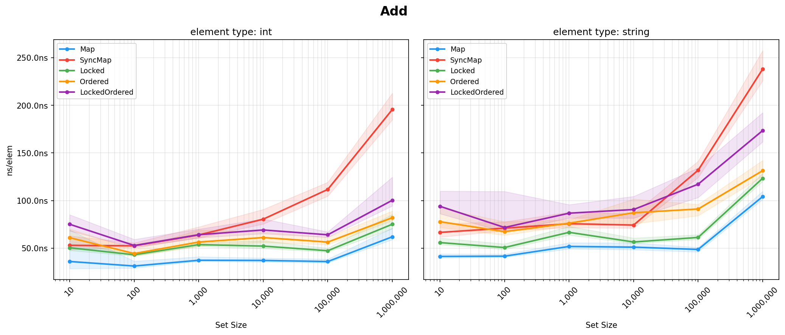

#### Contains
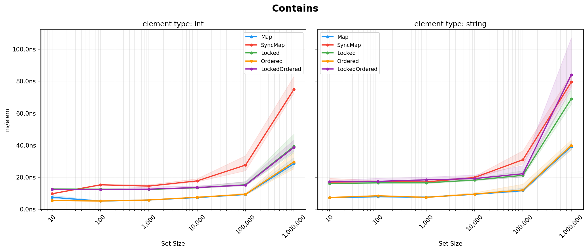

#### Remove
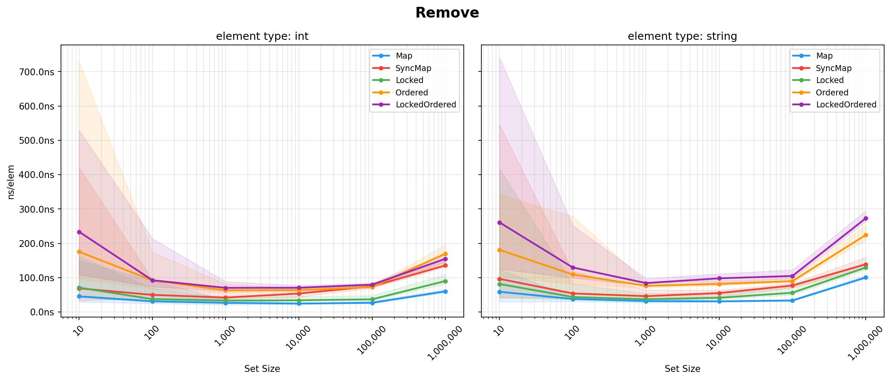

### Batch Operations (ns/op)

| Operation | Description |
|-----------|-------------|
| Clone | Copy the entire set |
| Filter | Keep ~50% of elements |
| MapBy | Transform all elements (identity) |
| Chunk | Split into N/10 chunks |

#### Clone
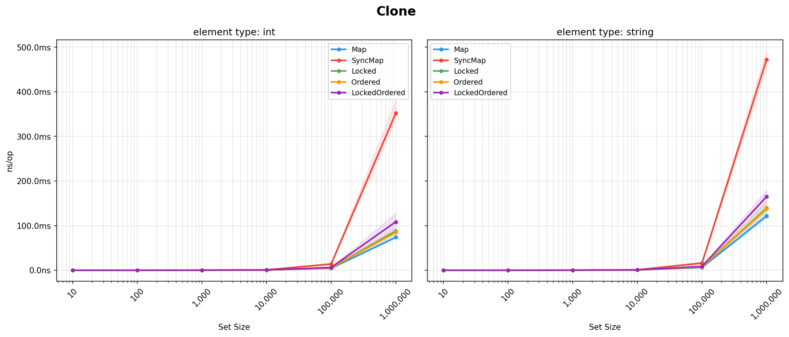

#### Filter
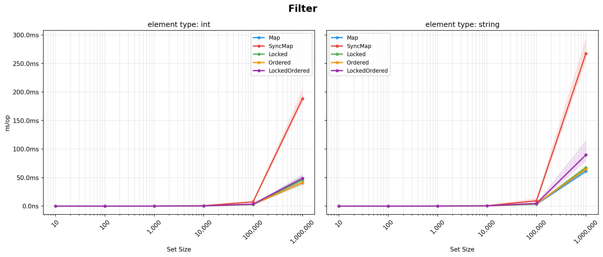

#### MapBy
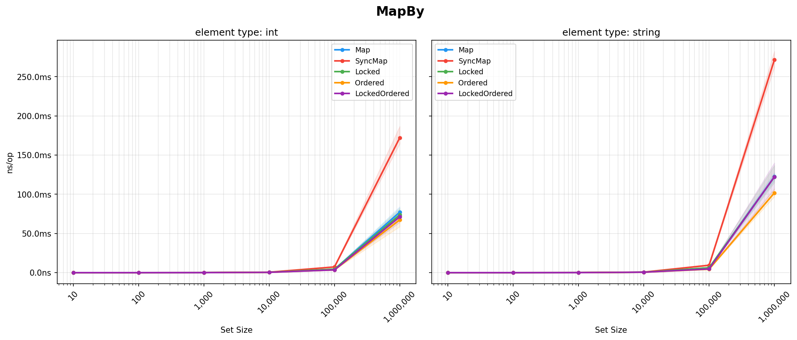

#### Chunk
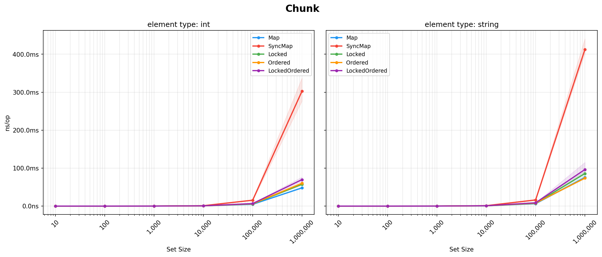

### Two-Set Operations (ns/op)

Both sets have N elements with 50% overlap.

| Operation | Description |
|-----------|-------------|
| Union | All elements from both sets |
| Intersection | Elements in both sets |
| Difference | Elements in first but not second |
| SymmetricDifference | Elements in one set but not both |

#### Union
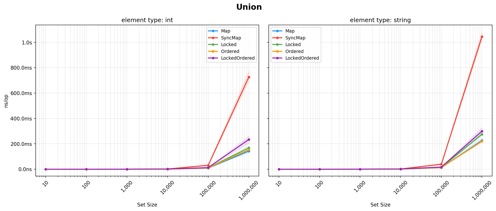

#### Intersection
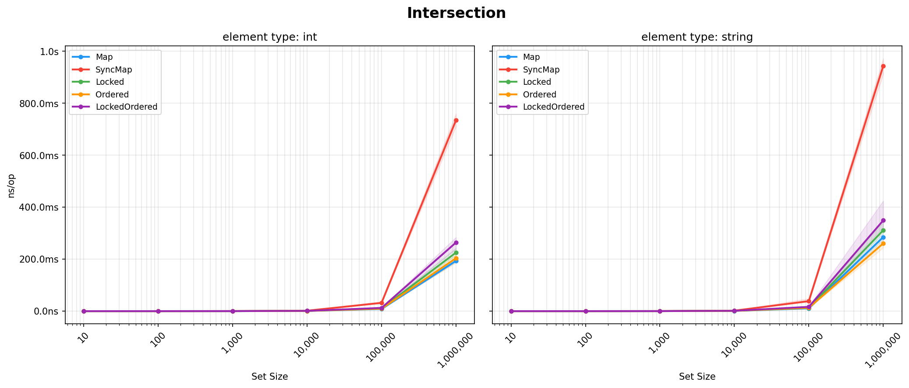

#### Difference
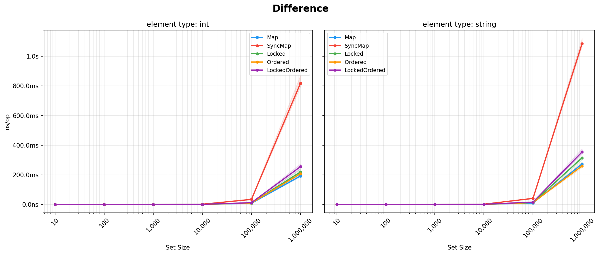

#### SymmetricDifference
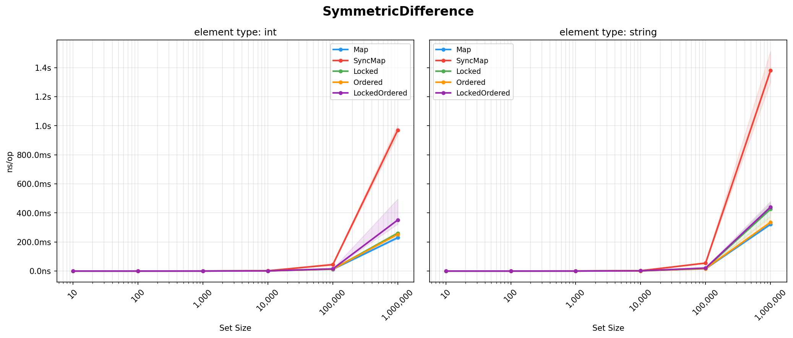

## Custom Set Types

You can implement your own set types as long as they conform to the interfaces and can use the package level functions
as they do not rely on any internal implementation details.

Custom implementations can also implement the optional single-method interfaces `Unioner[M]`, `Intersectioner[M]`,
`Differencer[M]`, and `SymmetricDifferencer[M]` — in any combination — to provide optimized implementations of the
corresponding package-level functions: each function checks its first operand for its interface and falls back to the
generic element-wise path when the operand doesn't implement it or the method reports it cannot handle the other set.
`BitSet` implements all four to combine two `BitSet`s word-wise; `SortedSet` implements all four to combine two
`SortedSet`s with a single linear merge of their sorted slices.

The methods return `(Set[M], bool)` rather than just `Set[M]` on purpose: the boolean lets an implementation decline a
specific operand (typically anything but its own concrete type) so the generic fallback algorithm lives only in this
package — implementations never reproduce it, and the worst outcome of declining is generic speed, never a wrong
result. See the `Unioner` godoc for the full contract.

The same pattern accelerates `Max` and `Min` via the optional `Maxer[M]`/`Minner[M]` interfaces: implementations that
can find an extreme element without iterating (both `SortedSet` and `BitSet` answer from the ends of their storage)
implement them, and the package-level functions fall back to the generic O(n) iteration when the method reports false.
See the `Maxer` godoc for the contract.

The predicates `Equal`, `Disjoint`, and `Subset` consult the optional `Equaler[M]`/`Disjointer[M]`/`Subsetter[M]`
interfaces the same way (`Superset` is `Subset` with the operands swapped, so it consults its *second* operand's
`Subsetter`). Both always-sorted implementations implement all three without hashing or allocating: `SortedSet` with
short-circuiting scans of the two sorted slices, `BitSet` with word-wise comparisons. See the `Equaler` godoc for the
contract.

## TODOs

* Ordered rapid tests that test the OrderedSet bits like the normal Set bits are tested.
